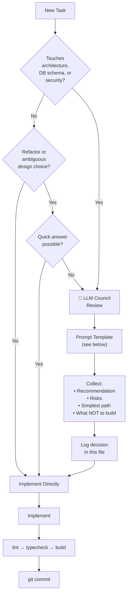

# LLM Council Review Log — NirmiqLearn OS

> Record every architecture, security, and overengineering decision here.
> AI tools should check this log before making similar decisions to avoid re-litigating settled choices.
> Reviews are specific to **this project (NirmiqLearn OS)** only. Do not log decisions for other projects here.

---

## When to Trigger a Council Review



---

## Council Prompt Template

```
Consult LLM Council for a concise MVP-focused review.

Question:
[specific architecture or design decision]

Context:
[2-3 sentences max — what the feature does, what you are deciding between]

Constraints:
- local-first (SQLite, no cloud required in MVP)
- student-buildable
- Next.js 16 App Router + TypeScript strict
- Avoid overengineering
- MVP scope only

Return:
1. Best recommendation for MVP
2. Key risks
3. Simplest implementation path
4. What NOT to build yet
```

---

## When NOT to Use Council

- Simple component styling
- Variable naming
- UI copy
- Adding a route that follows an established pattern
- Tasks Claude can handle alone with confidence

---

## Decision Log

---

### REVIEW-001 — Initial Stack and Architecture Choice

**Date:** 2026-06-04
**Phase:** 0 — Project Initialization
**Decision:** Choose MVP stack and database strategy

**Question Asked:**
What is the simplest stack for a local-first student learning OS that a solo developer can ship in phases, avoid overengineering, and iterate quickly on?

**Council Synthesis:**

**Recommendation:** Next.js App Router + SQLite via Drizzle ORM.

Rationale:
- Next.js App Router enables server components + server actions, removing the need for a separate API layer in MVP
- SQLite is zero-config, ships as a file, and is fast enough for a single local user
- Drizzle ORM is lightweight, type-safe, and generates clean migrations
- Zod handles validation at service boundaries without a full backend framework
- Zustand is appropriate for lightweight UI state (sidebar, theme, workspace selection) — persistent data stays in SQLite only

**Risks:**
- SQLite has no concurrent write support (not a problem for single-user local app)
- Drizzle migrations require manual management (acceptable for MVP)
- If multi-user sync is added later, SQLite must be swapped for Postgres — design services to be DB-agnostic

**Simplest Path:**
- Use `better-sqlite3` (synchronous driver) so service functions can be plain TypeScript without async complexity
- Use Drizzle `generate` + `migrate` commands as npm scripts
- No ORM magic — write explicit queries in services

**What NOT to Build Yet:**
- No Prisma (heavier, wrong abstraction for this stage)
- No Postgres (overkill for local single-user)
- No tRPC (unnecessary indirection when Server Actions work)
- No Redis/external cache
- No vector DB (save for Phase 9+ when local LLM is added)
- No real-time sync

**Status:** ✅ Accepted — implemented in Phase 0

---

### REVIEW-002 — Plug-and-play IDE Integration + Security Model

**Date:** 2026-06-06
**Phase:** Post-MVP Extension Architecture
**Decision:** How to make NirmiqLearn OS plug-and-play for any IDE, and the right security/privacy model for a local-first tool that reads project files.

**Question Asked:**
Should we build a VS Code extension, CLI tool, MCP server, or all three? What is the right security and privacy model for a local-first tool that reads project files?

**Council Synthesis:**

**Recommendation:** MCP server (highest leverage — works in Claude Code, Cursor, Windsurf natively) + CLI launcher (covers JetBrains, Neovim, any shell). Do NOT build a VS Code extension in MVP.

**Risks:**
- `better-sqlite3` requires native compilation — may fail on machines without build tools. Documented in README; `tsx` used to run the MCP server without a separate build step.
- MCP port collision — mitigated by using stdio transport (no network socket opened).
- Content-Disposition header injection — FIXED: `safeFilename()` now strips all non-alphanumeric characters before setting the header.
- `0.0.0.0` binding — FIXED: `--hostname 127.0.0.1` added to both `dev` and `start` scripts.
- Privacy via MCP — documented in Privacy Policy page and Settings.

**Simplest Path:**
1. Fix Content-Disposition injection and localhost binding (security fixes first).
2. Add security headers to `next.config.ts` (CSP, X-Frame-Options, Permissions-Policy).
3. Build MCP server (`mcp-server/index.ts`) with 7 tools backed by the existing service layer.
4. Build CLI (`bin/nirmiq.mjs`) — `start`, `mcp`, `open` commands; auto-adds `data/` to `.gitignore`.
5. Add Privacy Policy page + MCP setup guide in Settings.

**What NOT to Build Yet:**
- VS Code extension (VSIX release pipeline overhead; Cursor/Windsurf already use MCP)
- JetBrains plugin (CLI covers this)
- Cloud sync / auth (anti-product identity)
- Encrypted SQLite (overkill for MVP; document the limitation instead)

**Status:** ✅ Accepted — implemented in security + extension commit

---

### REVIEW-003 — Make GitHub import fully auto-populate the learning experience

**Date:** 2026-06-19
**Phase:** Post-MVP — plug-and-play import companion
**Decision:** When a repo is imported, every learning surface (learning map, DSA bridge, explain-back, overview) must be auto-generated from the repo + metadata. The user must never be required to manually fill content.

**Question Asked:**
After importing a repo, the learning-map and DSA-bridge pages still presented "Add Module / Add Checkpoint / Add Concept" as the primary action, implying manual data entry — the opposite of the product promise ("the app explains the project to you"). What should change?

**Council Synthesis:**

**Recommendation:** Keep the working pipeline and data model. The import already auto-populates (workspace + 10 questions + 5 concepts + learning map). The real gaps were: (a) two workspaces predated the import bug-fixes and were half-empty; (b) the auto-map didn't carry the CS concepts as module tags; (c) the feature pages led with manual-entry forms and empty-state copy that implied manual filling.

**Fix:** clear the stale workspaces; route all analyzer output into the map (section modules + CS-concept chips on the architecture module + understand-area checkpoints + full raw analysis); present auto-generated content first and demote the manual forms into a clearly separated, collapsed "Add your own" section; make empty-state copy point to import, not manual entry.

**Risks:**
- Re-import loses manual edits on stale workspaces — negligible, they were empty; deleted with confirmation.
- GitHub clone path less-tested than local path — mitigated by an end-to-end clone→analyze→populate verification.
- Over-stuffing the map — mitigated by capping concept chips and keeping summaries short.

**Simplest Path:**
1. Verify GitHub-URL import end-to-end on a small public repo.
2. Delete the two stale workspaces (with confirmation).
3. Enrich `buildLearningMapContent` — attach parsed CS concept names to the architecture module.
4. Learning-map & DSA-bridge pages: content-first; manual forms moved into a separate collapsed "Add your own" section; import-aware empty states.
5. Ship clean: lint → typecheck → build → manual re-import check.

**What NOT to Build Yet:**
- No per-file deep / AST analysis — section-based analysis is enough for MVP.
- No new DB tables or schema changes — everything needed is already stored.
- No AI requirement — the local analyzer must keep populating everything with no API key.

**Manual forms — explicitly KEPT (do not remove, do not rebuild):**
The "Add Module", "Add Checkpoint", and "Link a Concept" forms stay in the product. They are NOT removed and the editor is NOT rebuilt — they are simply demoted into a separate, collapsed "Add your own" section so users can still add their own notes on top of the auto-generated content. Auto-generation is the default; manual entry is the optional supplement.

**Status:** ✅ Accepted — implemented (import enrichment + content-first UI + stale-workspace cleanup)

---

---

### REVIEW-004 — Full Architectural Audit: Pre-Launch Readiness Assessment

**Date:** 2026-06-21
**Trigger:** Chief architect audit requested before further feature development. Covers the entire codebase as it stands on branch `feature/structural-cleanup`. No bias, no softening.

---

> **Verdict upfront:** This product has a compelling core idea and a well-reasoned stack. It also has 4 features that are broken and shipped as if they work, a data model that promises progress tracking but has no write path for it, and a session log feature whose entire data pipeline is severed. None of this is fatal — but shipping more features on top of this foundation without fixing these is how products die quietly.

---

#### TIER 1 — BROKEN FEATURES SHIPPED AS WORKING

These are not future work. They are defects visible to any user right now.

**1. `progressScore` is permanently 0.**
`workspaces.progressScore` exists in the schema. The workspace detail page (`app/(app)/workspaces/[id]/page.tsx:116–123`) renders it as `{ws.progressScore}%` with a cyan progress bar. `calculateWorkspaceProgress()` exists in `workspace.service.ts` but is never called from anywhere. Nothing in the codebase writes a non-zero value to this column. Every workspace a user creates or imports will show "Overall Progress: 0%" forever. This is not a missing feature — it is a broken promise that every user sees on the very first screen they land on after import.

**2. Session Log is permanently empty.**
The `session_logs` table exists. The `nirmiq_explain_command` MCP tool exists. The `/workspaces/:id/session-log` page exists. But `hooks/pre-bash.mjs` — the only intended data source — does NOT call the MCP tool. It calls the Anthropic API directly and writes the result to `stderr`. `createSessionLog()` is never triggered by the hook. The session log page will always be empty for any user who installs the hook. The feature is architecturally severed at the data ingestion point.

**3. Topbar Search does nothing.**
`components/layout/Topbar.tsx` renders a search field with a `<Search>` icon. It has no `onChange` handler, no `value` binding, no search logic, no results panel. A user who types in it gets zero feedback, zero results, and will assume the app is broken. A non-functional interactive element is worse than no element — it is a broken affordance.

**4. Topbar Export is disabled and leaks internal phase numbers to users.**
`Topbar.tsx:43`: `title="Export — available in Phase 8"`. Internal phase numbering is user-visible via the `title` attribute (shows on hover). The actual export works correctly at `/workspaces/:id/export` from the workspace detail page. Two export entry points with different UX and one permanently disabled creates confusion about whether export works at all.

---

#### TIER 2 — CRITICAL: DATA INTEGRITY AND SAFETY

**5. `analyzeCode()` blocks the HTTP request thread synchronously for the entire import.**
`lib/services/code-analyzer.service.ts` walks up to 300 files × 80KB each, runs 12 regex passes per file, builds the graph, and returns — all synchronously, all inside a Server Action. On a mid-sized repo this can block for 20–40 seconds. Node.js holds the HTTP connection open the entire time. The import page shows a static spinner with zero progress feedback. On large repos the browser will timeout.

**6. Local path import has no filesystem sandboxing.**
`resolveProjectPath()` accepts any local path string from the user. `walk()` in the code analyzer will recurse into any readable directory on the host — `/etc`, `C:\Windows\System32`, `~/.ssh`. Sensitive file content could end up in `codeSnippet` columns stored in SQLite.

**7. `conceptsJson` column is dead.**
`learning_maps.conceptsJson` is defined in `lib/db/schema.ts`, parsed in `learning-map.service.ts:toPresentation()`, but never written with a non-empty value. Every row in the database has `conceptsJson = "[]"`. The column occupies schema space, confuses any developer reading the schema, and creates a false API contract. Remove in the next migration.

**8. `daily_logs` has no uniqueness constraint on `(workspaceId, date)`.**
A user can create multiple logs for the same date. No `unique()` constraint at the Drizzle schema level, no deduplication check in `createDailyLog()`, and `createDailyLogSchema` validates only date format, not uniqueness.

**9. No error boundaries in any route.**
There is no `error.tsx` file anywhere in `app/`. Any unhandled exception in a Server Component shows Next.js's default white-screen error with no context, no recovery action, and no way for the user to understand what happened.

**10. `mcp-manifest.json` is out of sync with `mcp-server/index.ts`.**
The manifest lists 7 free tools; `index.ts` has 8 (`nirmiq_explain_command` missing from the manifest's free tier). The manifest lists 3 Pro tools; `index.ts` has 4 (`nirmiq_analyze_project` missing). Any IDE reading the manifest to discover tools silently misses 2 tools.

---

#### TIER 3 — HIGH: ARCHITECTURAL DEFICIENCIES

**11. `getAllXxx()` queries have no row limit.**
`getAllQuestions()`, `getAllDebugLogs()`, `getAllConceptLinks()`, `getAllDailyLogs()` select every row with no LIMIT clause. The dashboard calls 3 of these on every page load. A workspace with 500 questions will load them all into memory on every dashboard visit. This is a latent OOM waiting for any active user.

**12. Two competing knowledge graph implementations with no migration path.**
Old workspaces use `buildKnowledgeGraph()` derived at render time from modules and concept links. New workspaces use stored `map.graphJson` built from source code at import time. Different node structures, different edge types, fundamentally different visualizations. No migration path. The codebase now permanently carries two implementations.

**13. No workspace deletion from the UI.**
`archiveWorkspace()` is defined in `workspace.service.ts:88` but never called from any page, action, or MCP tool. A user who imports the wrong repo has no way to remove it. They must manually delete rows from the SQLite database file.

**14. No re-analysis capability.**
Project analysis is frozen at import time. If the codebase changes significantly, or if the initial AI analysis was poor, there is no "Refresh Analysis" action. The only recovery is to delete the workspace (which is also broken — see #13) and re-import from scratch.

**15. No loading states in any route.**
No `loading.tsx` file exists anywhere. All pages show nothing until every server query completes. The learning map page runs 3 parallel queries plus JSON parsing with no visual feedback.

**16. `hooks/pre-bash.mjs` is architecturally wrong for session logging.**
It is a **PreToolUse** hook — it runs before the command and can block with exit 2. Session logging (recording what was built) requires **PostToolUse** — running after the command, knowing the outcome. You cannot log "what was built" before the command has executed. Additionally, the hook makes an Anthropic API call for every non-trivial bash command with no rate limiting and no daily cost cap.

---

#### TIER 4 — MEDIUM: DEBT THAT COMPOUNDS

**17. Five orphaned service exports polluting the API surface.**
`archiveWorkspace`, `updateWorkspace`, `calculateWorkspaceProgress` (workspace.service.ts), `getRecentSessionLogs` (session-log.service.ts), `getDebugLogById` (debug-log.service.ts). Any developer reading the service files will treat these as active code paths. They are dead code with live export status.

**18. `updateWorkspaceSchema` is defined but never used.**
`lib/validators/workspace.schema.ts` exports `updateWorkspaceSchema` and `UpdateWorkspaceInput`. No action validates against it. Dead export suggesting a non-existent edit-workspace flow.

**19. `formatDate` is duplicated.**
Defined in `lib/utils.ts` (canonical location per CLAUDE.md). Also defined locally at `app/(app)/workspaces/[id]/page.tsx:34` with different formatting options. Direct violation of CLAUDE.md Rule #1: "reuse, don't recreate."

**20. `extractSection()` fails silently on Claude response format changes.**
The function uses regex to parse sections from Claude's structured response. If Claude's output varies in whitespace, header casing, or markdown formatting, it returns an empty string with no error, no log, no fallback. The user sees a populated workspace with hollow content.

**21. Binary PPTX committed to the repository.**
`docs/NirmiqLearn-Bootcamp-Pitch.pptx` is a binary file permanently in git history. It inflates clone size, cannot be diffed, and has no place in a code repository.

**22. Marketing content committed to the codebase.**
The `launch/` directory (bootcamp emails, HackerNews posts, Reddit posts, Twitter threads) is committed. This is not code, not documentation, not configuration. It pollutes `git log` and confuses any contributor reading the repository.

**23. Non-throwaway scripts committed in violation of CLAUDE.md.**
`scripts/build-pitch-deck.mjs` and `scripts/extract-pptx.py` are committed. CLAUDE.md explicitly requires scripts to be throwaway `_*.mts` files deleted after use. These are neither throwaway nor following the naming convention.

**24. `clean-room/` in repo root.**
Non-standard directory that confuses developers and tooling browsing the repository. `clean-room/architecture.md` belongs at `docs/ARCHITECTURE_STANDARD.md`.

**25. Hardcoded 2-second `setTimeout` in import success flow.**
An artificial 2-second delay before `router.push()` is a proxy for "wait for the server." Too short on slow machines, wasted time on fast ones. `importProjectAction` returns `workspaceId` — the client should navigate immediately on success.

---

#### TIER 5 — DESIGN GAPS: PRODUCT PROMISE VS DATA MODEL

**26. The product promises learning progress tracking. The data model does not deliver it.**
`progressScore` exists. `calculateWorkspaceProgress()` exists. Nothing writes to it. There is no formula, no trigger, no propagation from checkpoint completions or question confidence to workspace progress. The entire progress-tracking value proposition has zero data backing.

**27. Learning artifacts are siloed. They do not talk to each other.**
A `concept_link` has no FK to an `explain_back_questions` row. A `debug_log` has no FK to a learning map module. A question cannot be tagged to a module. The five features — learning map, explain-back, debug lab, DSA bridge, daily log — share only a `workspaceId`. This is not a learning system. It is five independent CRUD surfaces in one sidebar.

**28. Explain-back questions are workspace-flat, not module-scoped.**
`learningMapId` FK exists on questions but no `moduleId` FK. You cannot drill down to "show me questions about the API Layer module." All questions are a single undifferentiated list per workspace.

**29. The architecture graph is decorative, not navigable.**
Clicking a file node in `KnowledgeGraph.tsx` shows the filename and layer. No link to the file. No navigation to related questions or concept links sourced from that file. No actionable outcome. Beautiful visualization, zero utility.

**30. `CONCEPT_TYPES` (27 items) enforces nothing.**
Populates a UI dropdown but `conceptType` in the Zod schema is `z.string().max(100).optional()` — any string is valid. The constant provides dropdown UX but zero data integrity guarantee at the service or DB level.

**31. Session Log requires a configuration most users will never complete.**
To have any data: (1) MCP server running, (2) Claude Code hooks configured, (3) `hooks/pre-bash.mjs` installed via `install-hooks.mjs`, AND (4) Anthropic API key. Even then, the data pipeline is severed (Tier 1, issue #2). Effective active user rate of this feature: 0%.

---

#### TIER 6 — PROCESS

**32. Zero automated tests for a product whose core value is an import pipeline.**
`analyzeProject()`, `detectStack()`, `analyzeCode()`, `extractSection()`, `buildLearningMapContent()` represent the entire value creation of this product. None have unit tests. The 12 DSA regex signals have no tests. Any future refactor of the import pipeline is a blind operation. The verification gate (lint → typecheck → build) does not catch runtime logic bugs — it will pass even if `analyzeCode()` returns empty findings for every file.

---

#### Recommendation

Fix in this strict order before shipping any new feature:

1. **Immediately:** Remove or fix the disabled Topbar Export button. Remove "Phase 8" from any user-visible string.
2. **This sprint:** Wire `progressScore` to checkpoint completion rate. Add `error.tsx` to `app/(app)/`. Add `LIMIT 50` to all `getAllXxx()` queries. Add `unique()` constraint on `(workspaceId, date)` in daily_logs. Fix `mcp-manifest.json` to match `index.ts`.
3. **Next sprint:** Fix session log pipeline (convert to PostToolUse, call MCP tool). Add workspace deletion. Add re-analysis. Remove `conceptsJson` column via migration. Delete 5 orphaned service exports and the dead validator. Move `clean-room/` to `docs/`. Remove binary and marketing files from the repo.
4. **Before 1.0:** Cross-reference features (question → module FK). Real progress formula. Integration tests for the import pipeline happy path.

#### What NOT to Build Next

- No new features until Tier 1 (broken features) is resolved.
- No new MCP tools until the session log pipeline is working end-to-end.
- No onboarding flow until workspace deletion exists — onboarding users into a workspace they cannot remove is a trap.
- No performance optimization until pagination exists — optimizing a query that returns unbounded rows is theater.

#### Decision

> Stop adding features. One focused sprint on Tier 1 and Tier 2 will do more for this product than the next five features combined.

---

### REVIEW-005 — Remediation Sequencing for the 44 Audited Findings

**Date:** 2026-06-21
**Trigger:** Sequencing the fixes for REVIEW-004 (32 issues) + `AGENT_ARCHITECTURE_AUDIT.md` (12 findings) into a phased plan before any new feature work. Full plan: `~/.claude/plans/majestic-petting-plum.md`.

**Question Asked:**
Given 44 findings across two audits (many overlapping), what is the correct order to fix them for a local-first single-user MVP, and what should be deferred to avoid overengineering?

**Council Synthesis:**

**Recommendation:** Six phases, smallest-risk-and-highest-signal first. Commit to **P0 → P1 → P2 → P3** as the remediation sprint; treat **P4** as opportunistic cleanup and **P5** as deferred behind a second review.
- **P0 Honesty (ship today):** remove broken Topbar Search + disabled "Phase 8" Export, sync `mcp-manifest.json` to `index.ts`, instant import redirect, fix false injection comment. *(REVIEW-004 #3/#4/#10/#25, AGENT L2.)*
- **P1 Data Integrity:** progressScore write-path, local-import sandboxing, error/loading boundaries, pagination, daily_logs uniqueness, drop dead `conceptsJson`. *(#1/#6/#7/#8/#9/#11/#15/#26, AGENT M3.)*
- **P2 Agent Correctness:** structured outputs replace regex-on-prose; unify analyze pipelines; truthful tool contracts; audit-wrap every MCP call. *(#20, AGENT C1/C2/H1/H2/H3/H4/M1/M2/L1.)*
- **P3 Session Log Repair:** PostToolUse hook → MCP tool → DB; delete the hidden LLM pass; cost cap. *(#2/#16/#31, AGENT C3.)*

**Risks:**
- Structured-outputs rewrite (P2/C1) is highest-leverage AND highest-risk — mitigate with a count assertion behind the existing local-analyzer fallback, verified on real repos before deleting the old regex path.
- Schema migrations (conceptsJson drop, daily_logs unique, P5 FKs) — always `npm run db:generate`, never hand-edit journal timestamps, stop dev server before migrate.
- Scope creep into P5 — gated behind a separate review.

**Simplest Path:**
1. P0 honesty pass (one commit, ship immediately).
2. P1 progressScore first, then the safety net.
3. P2 structured outputs; unify pipelines last.
4. P3 single hook, single path, cost cap.
5. Stop, re-audit, then consider P4/P5.

**What NOT to Build Yet:**
- No real Topbar search (P5, not now); no graph-implementation migration (#12 — keep documented fallback); no test framework in P0–P4; no new MCP tools until P3 works; no onboarding until workspace deletion (#13) exists.

**Decision:**
> Approve P0–P3 as the remediation sprint; defer P4 to opportunistic cleanup and P5 behind a second review. Fix the foundation before shipping anything new.

**Status:** ✅ Accepted — P0 implemented (this commit); P1–P3 to follow.

---

## Architecture Decisions Summary

| ID | Decision | Outcome | Phase |
|----|----------|---------|-------|
| REVIEW-001 | Stack: Next.js + SQLite + Drizzle | ✅ Accepted | 0 |
| REVIEW-002 | MCP server + CLI; no VS Code extension; security hardening | ✅ Accepted | Post-MVP |
| REVIEW-003 | Import auto-populates all surfaces; content-first UI; manual forms kept but collapsed | ✅ Accepted | Post-MVP |
| REVIEW-004 | Full architectural audit — 32 issues across 6 severity tiers; fix Tier 1+2 before any new features | ⚠️ Audit — action required | Pre-1.0 |
| REVIEW-005 | Remediation sequencing — 6 phases (P0–P5); commit P0–P3, defer P4/P5 | ✅ Accepted — P0 done | Pre-1.0 |
