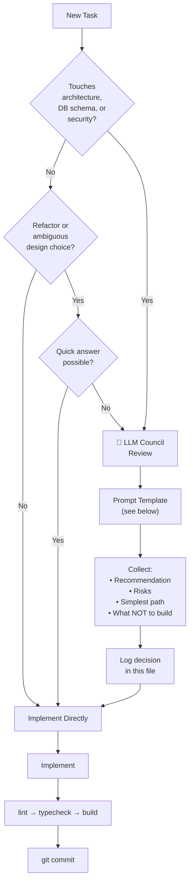

# LLM Council Review Log — NirmiqLearn OS

> Record every architecture, security, and overengineering decision here.
> AI tools should check this log before making similar decisions to avoid re-litigating settled choices.

---

## When to Trigger a Council Review



---

## Council Prompt Template

```
Consult LLM Council for a concise MVP-focused review.

Question:
[specific architecture or design decision]

Context:
[2-3 sentences max — what the feature does, what you are deciding between]

Constraints:
- local-first (SQLite, no cloud required in MVP)
- student-buildable
- Next.js 16 App Router + TypeScript strict
- Avoid overengineering
- MVP scope only

Return:
1. Best recommendation for MVP
2. Key risks
3. Simplest implementation path
4. What NOT to build yet
```

---

## When NOT to Use Council

- Simple component styling
- Variable naming
- UI copy
- Adding a route that follows an established pattern
- Tasks Claude can handle alone with confidence

---

## Decision Log

---

### REVIEW-001 — Initial Stack and Architecture Choice

**Date:** 2026-06-04
**Phase:** 0 — Project Initialization
**Decision:** Choose MVP stack and database strategy

**Question Asked:**
What is the simplest stack for a local-first student learning OS that a solo developer can ship in phases, avoid overengineering, and iterate quickly on?

**Council Synthesis:**

**Recommendation:** Next.js App Router + SQLite via Drizzle ORM.

Rationale:
- Next.js App Router enables server components + server actions, removing the need for a separate API layer in MVP
- SQLite is zero-config, ships as a file, and is fast enough for a single local user
- Drizzle ORM is lightweight, type-safe, and generates clean migrations
- Zod handles validation at service boundaries without a full backend framework
- Zustand is appropriate for lightweight UI state (sidebar, theme, workspace selection) — persistent data stays in SQLite only

**Risks:**
- SQLite has no concurrent write support (not a problem for single-user local app)
- Drizzle migrations require manual management (acceptable for MVP)
- If multi-user sync is added later, SQLite must be swapped for Postgres — design services to be DB-agnostic

**Simplest Path:**
- Use `better-sqlite3` (synchronous driver) so service functions can be plain TypeScript without async complexity
- Use Drizzle `generate` + `migrate` commands as npm scripts
- No ORM magic — write explicit queries in services

**What NOT to Build Yet:**
- No Prisma (heavier, wrong abstraction for this stage)
- No Postgres (overkill for local single-user)
- No tRPC (unnecessary indirection when Server Actions work)
- No Redis/external cache
- No vector DB (save for Phase 9+ when local LLM is added)
- No real-time sync

**Status:** ✅ Accepted — implemented in Phase 0

---

### REVIEW-002 — Plug-and-play IDE Integration + Security Model

**Date:** 2026-06-06
**Phase:** Post-MVP Extension Architecture
**Decision:** How to make NirmiqLearn OS plug-and-play for any IDE, and the right security/privacy model for a local-first tool that reads project files.

**Question Asked:**
Should we build a VS Code extension, CLI tool, MCP server, or all three? What is the right security and privacy model for a local-first tool that reads project files?

**Council Synthesis:**

**Recommendation:** MCP server (highest leverage — works in Claude Code, Cursor, Windsurf natively) + CLI launcher (covers JetBrains, Neovim, any shell). Do NOT build a VS Code extension in MVP.

**Risks:**
- `better-sqlite3` requires native compilation — may fail on machines without build tools. Documented in README; `tsx` used to run the MCP server without a separate build step.
- MCP port collision — mitigated by using stdio transport (no network socket opened).
- Content-Disposition header injection — FIXED: `safeFilename()` now strips all non-alphanumeric characters before setting the header.
- `0.0.0.0` binding — FIXED: `--hostname 127.0.0.1` added to both `dev` and `start` scripts.
- Privacy via MCP — documented in Privacy Policy page and Settings.

**Simplest Path:**
1. Fix Content-Disposition injection and localhost binding (security fixes first).
2. Add security headers to `next.config.ts` (CSP, X-Frame-Options, Permissions-Policy).
3. Build MCP server (`mcp-server/index.ts`) with 7 tools backed by the existing service layer.
4. Build CLI (`bin/nirmiq.mjs`) — `start`, `mcp`, `open` commands; auto-adds `data/` to `.gitignore`.
5. Add Privacy Policy page + MCP setup guide in Settings.

**What NOT to Build Yet:**
- VS Code extension (VSIX release pipeline overhead; Cursor/Windsurf already use MCP)
- JetBrains plugin (CLI covers this)
- Cloud sync / auth (anti-product identity)
- Encrypted SQLite (overkill for MVP; document the limitation instead)

**Status:** ✅ Accepted — implemented in security + extension commit

---

## Architecture Decisions Summary

| ID | Decision | Outcome | Phase |
|----|----------|---------|-------|
| REVIEW-001 | Stack: Next.js + SQLite + Drizzle | ✅ Accepted | 0 |
| REVIEW-002 | MCP server + CLI; no VS Code extension; security hardening | ✅ Accepted | Post-MVP |

