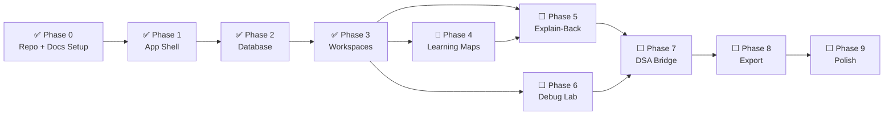
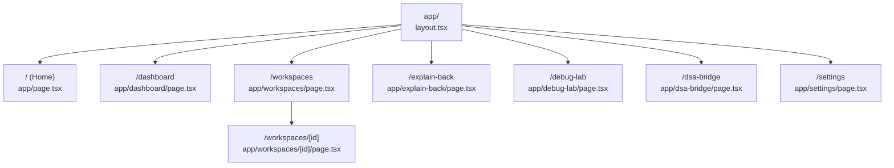
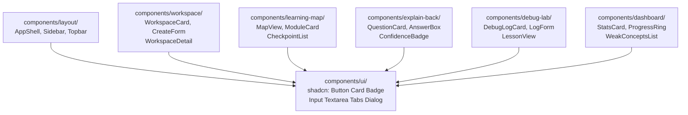
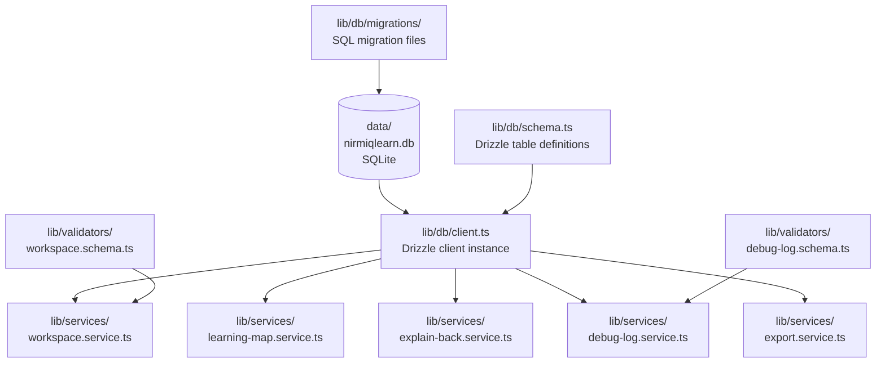
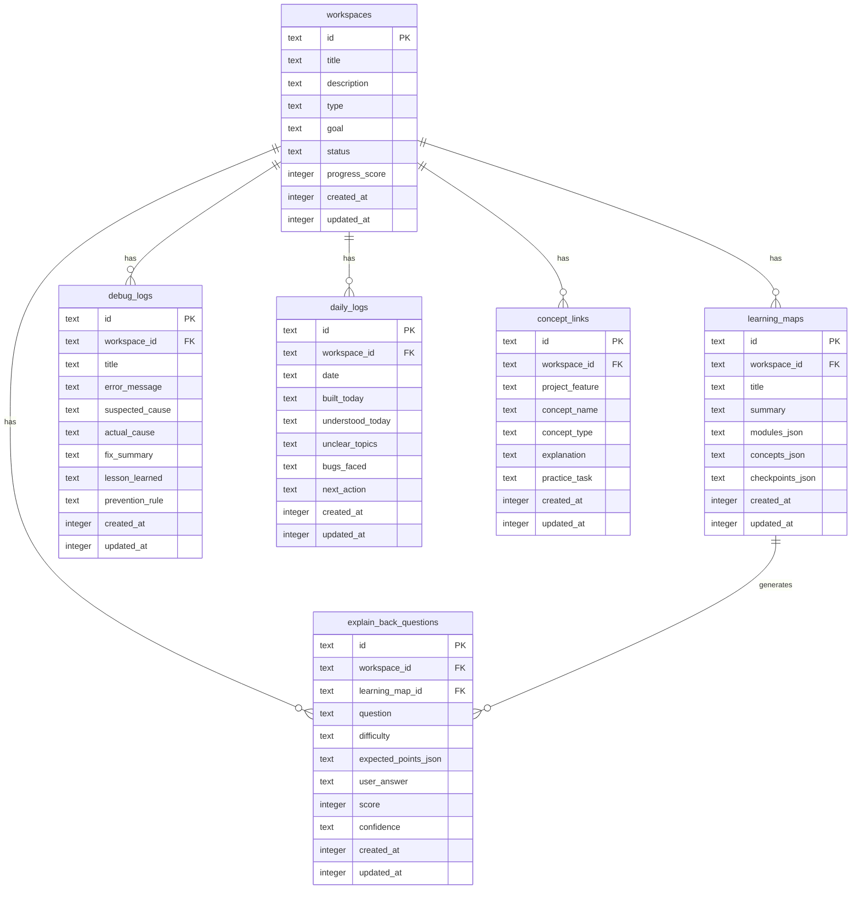

# Graphify Knowledge Graph — NirmiqLearn OS

> This file is the living codebase map. Update it whenever a new file, module, or feature is added.
> AI tools should read this file INSTEAD of scanning the whole repo.
> Graphify MCP populates and queries this graph as code grows.

---

## How to Use This File

**Before coding:**
```
Read docs/GRAPHIFY_MAP.md.
Find the relevant node(s) for your task.
Read only those files. Do not load unrelated files.
```

**After coding:**
```
Update docs/GRAPHIFY_MAP.md with any new files or changed relationships.
```

---

## Phase Progress Graph



---

## App Route Graph



---

## Component Dependency Graph



---

## Service + Database Graph



---

## Database Schema Graph



---

## Feature → File Map (Quick Reference)

| Feature | Files to Read |
|---------|--------------|
| Workspace CRUD | `lib/services/workspace.service.ts`, `lib/db/schema.ts`, `app/workspaces/page.tsx`, `components/workspace/` |
| Learning Map | `lib/services/learning-map.service.ts`, `components/learning-map/`, `app/workspaces/[id]/page.tsx` |
| Explain-Back | `lib/services/explain-back.service.ts`, `components/explain-back/`, `app/explain-back/page.tsx` |
| Debug Lab | `lib/services/debug-log.service.ts`, `components/debug-lab/`, `app/debug-lab/page.tsx` |
| Dashboard | `components/dashboard/`, `app/dashboard/page.tsx` |
| Export | `lib/services/export.service.ts` |
| Layout / Navigation | `components/layout/`, `app/layout.tsx` |
| DB Schema | `lib/db/schema.ts`, `lib/db/client.ts` |
| Validation | `lib/validators/` |

---

## Current File Status

| File | Phase | Status |
|------|-------|--------|
| `app/page.tsx` | 0 | ✅ Done |
| `app/layout.tsx` | 0 | ✅ Done |
| `app/globals.css` | 0 | ✅ Done |
| `app/(app)/layout.tsx` | 1 | ✅ Done |
| `app/(app)/dashboard/page.tsx` | 1 | ✅ Done |
| `app/(app)/workspaces/page.tsx` | 1 | ✅ Done |
| `app/(app)/explain-back/page.tsx` | 1 | ✅ Done |
| `app/(app)/debug-lab/page.tsx` | 1 | ✅ Done |
| `app/(app)/dsa-bridge/page.tsx` | 1 | ✅ Done |
| `app/(app)/daily-log/page.tsx` | 1 | ✅ Done |
| `app/(app)/settings/page.tsx` | 1 | ✅ Done |
| `components/layout/AppShell.tsx` | 1 | ✅ Done |
| `components/layout/Sidebar.tsx` | 1 | ✅ Done |
| `components/layout/Topbar.tsx` | 1 | ✅ Done |
| `lib/db/schema.ts` | 2 | ✅ Done |
| `lib/db/client.ts` | 2 | ✅ Done |
| `lib/db/migrate.ts` | 2 | ✅ Done |
| `lib/db/migrations/` | 2 | ✅ Done |
| `lib/types.ts` | 2 | ✅ Done |
| `drizzle.config.ts` | 2 | ✅ Done |
| `instrumentation.ts` | 2 | ✅ Done |
| `lib/validators/workspace.schema.ts` | 3 | ✅ Done |
| `lib/services/workspace.service.ts` | 3 | ✅ Done |
| `app/(app)/workspaces/page.tsx` | 3 | ✅ Done |
| `app/(app)/workspaces/new/page.tsx` | 3 | ✅ Done |
| `app/(app)/workspaces/[id]/page.tsx` | 3 | ✅ Done |
| `app/(app)/workspaces/actions.ts` | 3 | ✅ Done |
| `components/workspace/WorkspaceCard.tsx` | 3 | ✅ Done |
| `components/workspace/CreateWorkspaceForm.tsx` | 3 | ✅ Done |
| `lib/services/learning-map.service.ts` | 4 | ⬜ Todo |
| `lib/services/explain-back.service.ts` | 5 | ⬜ Todo |
| `lib/services/debug-log.service.ts` | 6 | ⬜ Todo |
| `lib/services/export.service.ts` | 8 | ⬜ Todo |

> Update this table after completing each file.
